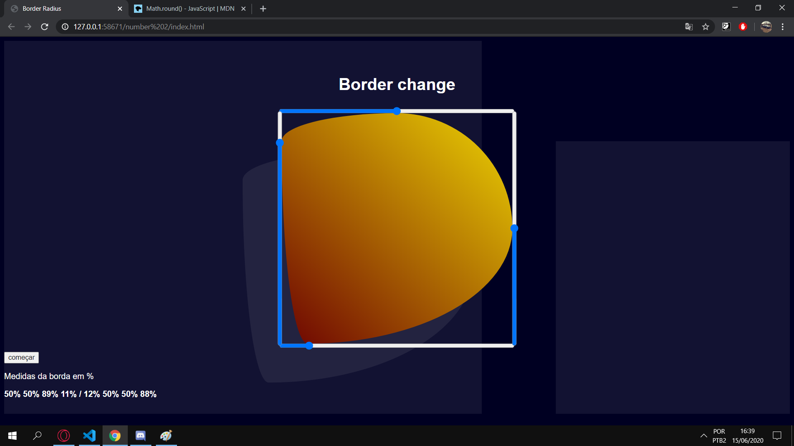

# Border Radius

### Description
- [x] This program give you the percentage to change your radius.

- [x] You can drag the button to modify the border.
- [x] Measurements are in the bottom left corner.
- [x] Hope you enjoy with this program.
- [x] Have a good day (^-^)/.

## :runner: To run this project ?

You needs load the project files in a web server, use [Live Server](https://marketplace.visualstudio.com/items?itemName=ritwickdey.LiveServer) for this.

## Just a spoiler

